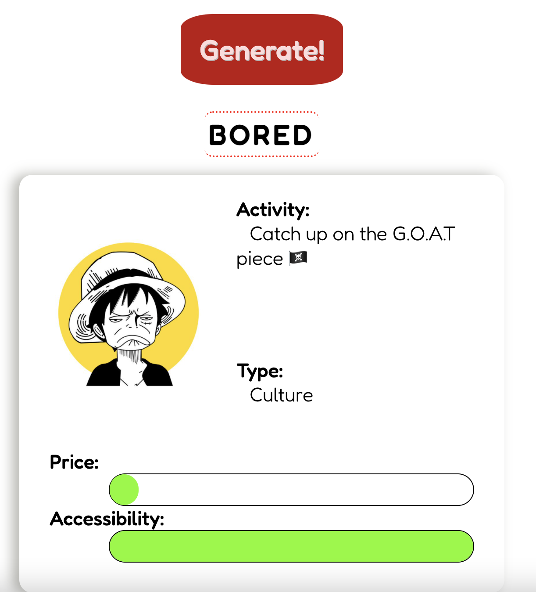
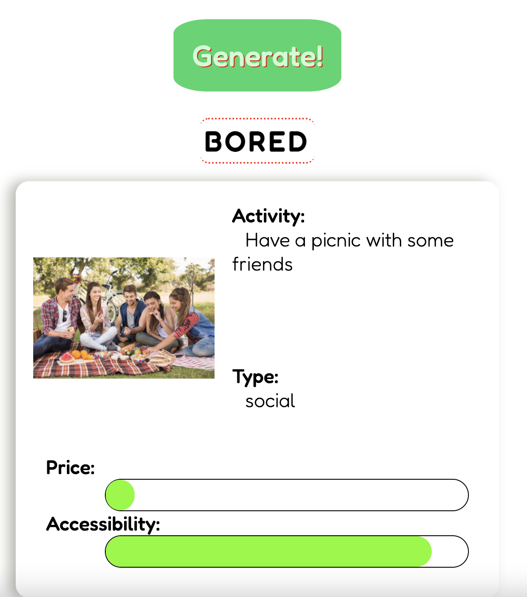
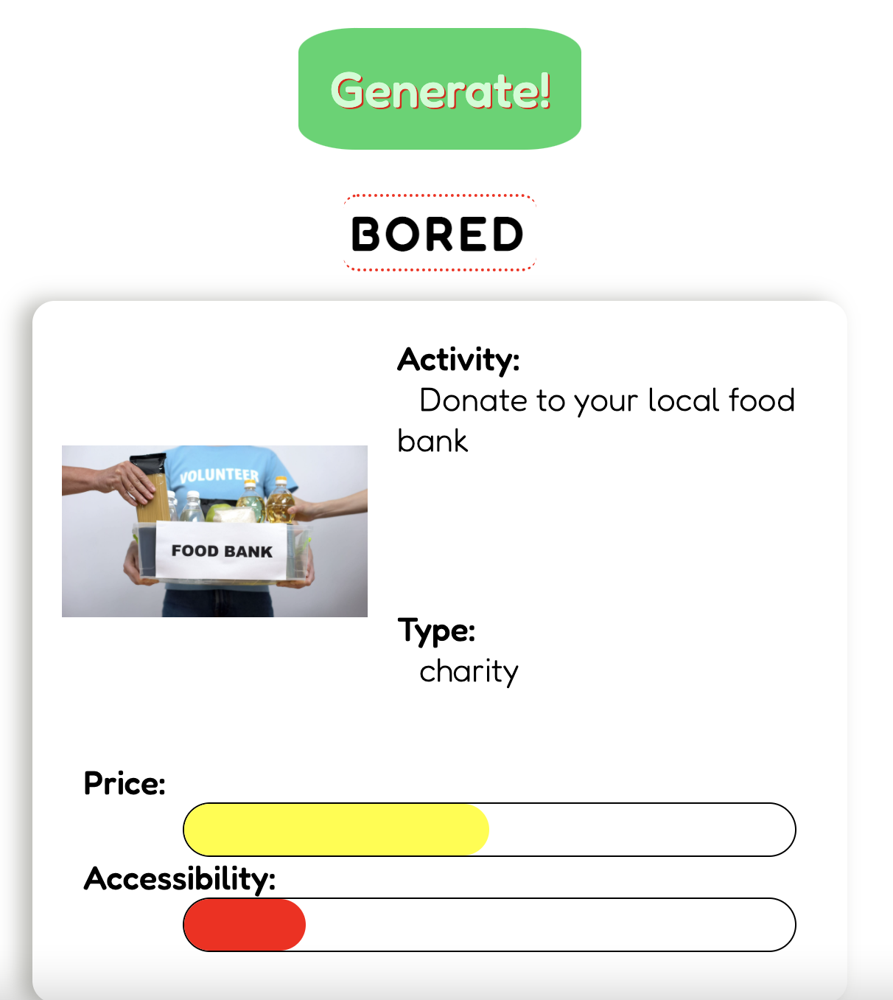

BORED

A small web app that suggests you random activities from [Bored API](https://www.boredapi.com/) and produces relevant images with [Bing's image search API](https://www.microsoft.com/en-us/bing/apis/bing-image-search-api)

[check it out 😁](https://mustafabin.github.io/Bored/)

landing page :

On generate it populates the card with the bored API info

And replaces the img with a bing image search result with the query being activity description

The sliders changes color based on how afforable and accessible the activity is accoriding to the Bored API standards

